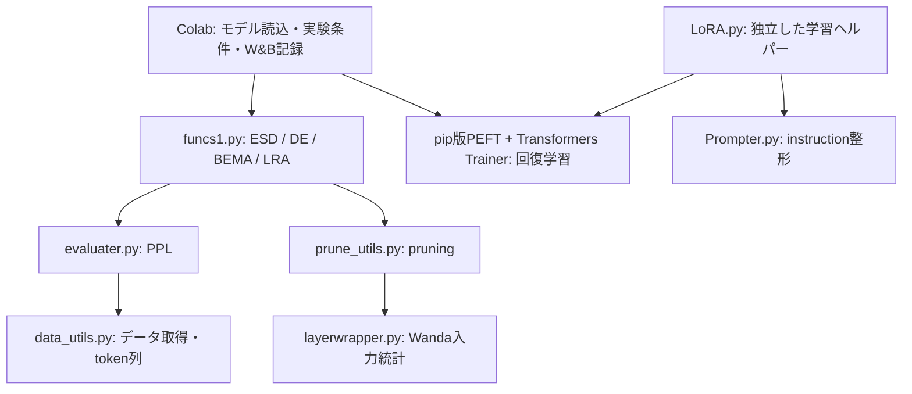

# RMT_utils

学習済みニューラルネットワークの重み行列をランダム行列理論（RMT）で解析し、低ランク近似（LRA）・pruning・LoRAによる回復を実験するための関数集です。主な利用先はColabのLlama-3.2-3BとGemma-3-4Bの実験ノートです。

2026-09-19の修正は、コミット`2959f275bd21a2e0e631a12b693ccb5f15c75f78`を基にしています。変更箇所には日本語の`# 修正:`、`# 高速化:`コメントを置いています。詳細は[変更記録](CHANGES.md)を参照してください。

## 全体の流れ



Colabがモデルを読み込み、`get_esd_metrics`で行列ごとの情報をDataFrameにまとめます。そのDataFrameで行列の順序を決め、`run_lra_experiment`や`run_pruning_experiment`を実行します。PPL評価は`evaluater.py`が`data_utils.py`のtoken列を使って行います。既存ColabのLoRA学習はノート内で定義した関数であり、ルートの`LoRA.py`を使う学習とは設定が異なります。

## ファイルと役割

| ファイル | 主な公開API | 役割・注意点 |
|---|---|---|
| `funcs1.py` | `get_esd_metrics` | Linear/Conv2dのスペクトル、α、DE前後のBEMA・KS指標 |
| 同上 | `dyson_equalizer_algorithm1` | 行・列方向の対角スケーリングを推定。入力は行数≤列数 |
| 同上 | `bema_algorithm1_from_data`, `bema_algorithm1_from_eigenvalues` | ノイズ分散・閾値・推定ランク |
| 同上 | `apply_lra_1`, `get_lra_model`, `apply_lra` | 一行列の近似、重みの書戻し、α閾値による一括近似 |
| 同上 | `run_lra_experiment`, `run_pruning_experiment`, `get_ppl` | 実験実行と評価を接続 |
| 同上 | `qmp_stable`, `mp_upper_quantiles`, `mp_pdf_zero_excluded`, `tw1_quantile` | MP分布・TW閾値の数値計算 |
| 同上 | `apply_bema`, `bema_loss`, `gaussian_broadening_fit` | 旧・実験的推定法。標準のColab経路では使用しない |
| `evaluater.py` | `ppl_eval`, `ppl_eval2`, `ppl_eval3` | token数で重み付けした平均NLLからPPLを計算 |
| 同上 | `ppl_eval_large`, `eff_eval` | 配置済み大型モデルのPPL、生成速度測定 |
| `data_utils.py` | `get_test_data`, `get_calib_train_data`, `get_loaders`など | WikiText-2/PTB/C4の評価・校正・学習用データ |
| `prune_utils.py` | `alpha_prune_llama`, `compute_mask`, `compute_mask_2`, `check_sparsity` | α・逆方向・一律割当て、magnitude/random pruning |
| 同上 | `prune_vit_*`の3関数 | vit_pytorch構造向けの一律／行列別／ブロック別pruning |
| `layerwrapper.py` | `WrappedLayer` | Wanda用の入力絶対値・二乗平均とbias補正 |
| `LoRA.py` | `apply_lora`, CLI `main` | instructionデータを用いた追加学習。Colab内の学習とは別経路 |
| `Prompter.py` | `Prompter`, `ZeroPrompter` | Alpaca/JSONテンプレートと応答の抽出 |
| `legacy/peft/` | 実行用ではない | 同梱されていた古いPEFT部分コピーを保存 |
| `tests/` | pytest | 数値、API互換性、小型Llama/Gemmaの接続テスト |
| `tools/benchmark.py` | microbenchmark | thin SVD・MP計算再利用のCPU計測 |

### 同梱PEFTの扱い

旧`peft/`は`utils`などが欠けている0.3.0.dev0の部分コピーでした。作業ディレクトリによってpip版を隠し、`import peft`が失敗するため、元のソースを`legacy/peft/`に移しました。Colabの`from peft import LoraConfig, TaskType, get_peft_model`はpip版を利用します。legacyを`sys.path`へ追加しないでください。

旧ファイル群の役割は以下です。

- `mapping.py`：設定・タスク種別とモデルラッパーの対応。
- `peft_model.py`：adapterの読込・保存・タスク別forward。
- `tuners/lora.py`：LoRA線形層の置換、adapterの合成。
- `tuners/adalora.py`：適応的なrank割当て。
- `tuners/prompt_tuning.py`, `p_tuning.py`, `prefix_tuning.py`：各prompt学習方式。
- `import_utils.py`：bitsandbytes等の任意依存の確認。

これらを現行Transformers用に個別改造する代わりに、保守されているpip版へ実行を集約しました。旧pickle内の独自PEFTクラスの復元は未検証です。

## 依存ライブラリと実行

通常は既存Colabのセットアップを使えます。ローカルで新しく準備する場合は以下です。CUDA環境のPyTorchは環境に合ったものを先に導入してください。

```bash
python -m pip install -r requirements.txt
# ViTのWeightWatcher解析を使用する場合だけ追加
python -m pip install weightwatcher
# 開発・確認用
python -m pip install pytest
python -m pytest -q
python tools/benchmark.py
```

NumPy/SciPy/Pandas/PyTorchが数値計算、datasets/Transformers/PEFT/Accelerateがデータ・モデル・学習を担当します。W&B、seaborn、matplotlib、google.colabは主にノート側の依存です。WeightWatcherはViTの指標計算時だけ読み込み、LLMの関数をimportするためには要求しません。

確認した環境：Python 3.9.6、torch 2.8.0、NumPy 2.0.2、SciPy 1.13.1、Pandas 2.3.3、Transformers 4.57.6、PEFT 0.17.1、Accelerate 1.10.1、datasets 4.5.0。Colabの全バージョン組合せを保証するものではありません。

## 既存Colabとの互換性

公開関数の名前・引数名と順序は維持しています。`tests/public_api.json`は修正前の公開引数を記録し、テストで照合します。ESDのDataFrame列名・順序、LRA履歴の5列、pruningの辞書、DEの3つの戻り値も維持しています。

```python
import funcs1

results = funcs1.get_esd_metrics(model, pl_fitting="fix-finger")
order = results.sort_values("alpha", ascending=True)["name"].tolist()
history = funcs1.run_lra_experiment(
    model, tokenizer, results,
    lra_list=order, max_lra_layers=20,
    DE=True, fast_SVD=False, PPLcalc=True,
    dataset_name="wikitext2", seq_len=1024, batch_size=2,
)
```

Gemmaは既存ノートと同様に言語部分で指標を計算し、外側のモデルでPPLを評価します。既存のprefix調整コードはそのまま使用できます。`device_map`で配置済みのモデルは評価時に一括移動しません。

LRA/pruningは渡したモデルを**in-placeで変更**します。独立した条件の比較には、従来どおり各条件で元モデルを読み直してください。

今回Colabのipynbは変更していません。更新されたリポジトリをclone/pullした後も、既存ノートの呼出しを使う設計です。既存ランタイムに古いモジュールがimport済みなら再起動して読み直します。

## 指標と計算上の約束

### ESDとDE

行列を`Y.shape=(p,n), p<=n`へ向きをそろえます。

- `eigs`は重みの特異値の二乗で、`n`では割っていません。
- `spectral_norm`は歴史的な名前を維持していますが、中身は最大特異値の**二乗**です。
- BEMA/MP/KSで使う固有値は`singular_values**2 / n`です。
- `alpha`はべき分布の裾の推定値。`median`／`fix-finger`／`goodness-of-fit`を選べます。fix-fingerは線形ビンのピークを使う既存の定義です。goodness-of-fitは裾の開始位置を限定探索する近似で、厳密な全候補探索ではありません。
- `s_hat_preDE/postDE`はBEMA閾値を超える固有値数。`KS_postDE_1`は分散1のMPへの距離であり、BEMAで推定するrank閾値とは別です。
- `tail_xmin`はCPUのPython float。保存時にGPU Tensorを残しません。
- Conv2dは`out × (in*kh*kw)`へ展開します。旧版の3D処理は後続の2D解析で失敗していたため、修正後はこの定義に統一しています。
- ゼロ行列のDEは変化なし・scale=1、αはNaN。非ゼロなのに特異値中央値が0の場合、元のDE式が定義できないためValueErrorを返します。

### PPL

`PPL = exp(全評価tokenのNLL合計 / 評価token数)`です。系列境界をまたぐ予測と末尾の系列長未満の端数を除く既存の分割を維持しています。paddingを含む辞書batchではpaddingとその直後の予測を除外します。

NaN/Infのlogitsがある場合は例外で停止します。旧版のようにそのbatchを黙って除いてPPLを計算しません。交差エントロピーはfloat32で計算するため、旧版の低精度計算とは微小差が出る場合があります。

`ppl_eval_large`は学習済みnormを正しく使う通常のforwardへ統一しました。旧版の手動layer-by-layerのCPU/GPU移送は行いません。大型モデルは呼出し前にAccelerate等で配置する必要があります。

評価token列はCPUに最大2設定までキャッシュします。tokenizerや語彙・normalizer、データ内容を変更した場合は`data_utils.clear_test_data_cache()`で破棄してください。

### pruningと削減率

`compute_mask`はTrueが**削除**、`compute_mask_2`はTrueが**保持**です。この違いは互換性のため残しています。同点でも指定個数だけ削除し、同点内の選択はflat index順です。

αはブロックを含む完全な行列名で対応づけます。`q_proj`という末尾名だけの曖昧な対応は拒否します。sparsityは対象行列のパラメータ数で重み付けした予算に合わせます。丸めによる個数の差や既存ゼロによる差はあり得ます。`lm_head`はpruningの対象外ですが、既存`check_sparsity`は全Linearを数えるため、その集計値とは分母が異なる場合があります。

LRAは低ランク行列を元のdense重みに書き戻します。`run_lra_experiment`の削減率は因子化した場合の`r*(m+n)`を用いた見積りで、実メモリ/速度の改善ではありません。旧`apply_lra`は戻り値の互換性のため`r*(m+n+1)`を維持しています。LoRA追加分もこの推定には含みません。

## 高速化した箇所

- DEの右特異ベクトルを`n×n`から`n×p`へ縮小。`full_matrices`引数は受け付けますが内部は常にthin SVDです。
- `get_esd_metrics`のpreDE SVDをDEへ再利用。BEMAとKS用の重複Gram行列・固有値分解を削除。
- MPの20万点積分を行列の縦横比ごとに最大16件キャッシュ。KSにも共通CDFの補間を利用。
- `U @ diag(S) @ Vh`を`(U*S) @ Vh`へ変更。
- PPLのlossを全batch保持せず加算。大きな語彙でもfloat32変換をtoken方向のchunkに限定。
- 同一tokenizerでの反復PPL評価のtokenizeを再利用。
- pruningの全体メタデータ探索を一回にし、完全sortをkthvalueへ変更。

CPU上の64×1024行列、3回の中央値ではSVD単体が約26.5ms→4.36ms（約6.1倍）でした。右特異ベクトル配列は8MiB→0.5MiB。これは**SVD単体の小規模計測**で、Llama/Gemma全体やGPUでの倍率ではありません。[計測結果](benchmark_results.json)と再実行用スクリプトを同梱しています。

## 検証と残る範囲

29件のテストが通過しています。[出力](test_results.txt)

- thin/full SVDによるDEの数値一致。
- 通常SVD・DE付きSVDの低ランク近似の参照計算との一致。
- BEMAのSVD経由とGram行列経由の一致、MP分位点と数値積分の一致。
- 零行列・Conv2d・同点マスク・行列別αの対応・予算。
- train/test split、キャッシュ分離、端数の校正batch。
- PPLの参照値・chunk境界・padding・非有限値・分割配置・モード復元。
- 小型Llama/GemmaのESD→LRA→PEFT→逆伝播→PPL。
- `LoRA.apply_lora`の小型モデルでの学習。
- ViTの可変Linear数、公開APIの引数。

実際の3B/4Bモデルの再評価、CUDA/複数GPU/offload、実際のWeightWatcherでの全モデル構成、全instructionデータ形式は未検証です。ViTのWeightWatcher cacheは行列数を検査しますが、同じ形状で重みが更新された場合や列挙順が変わった場合は作り直す必要があります。

`apply_bema`は旧モンテカルロ目的関数で評価ごとの乱数による揺らぎがあり、`gaussian_broadening_fit`も統計的妥当性が未検証の試作です。警告を出し、標準のBEMA Algorithm 1と区別しています。TW分位点のfallbackは既存の近似表・補間で、厳密なTW計算ではありません。

不具合修正でαによるpruning配分・KS・PPLが変わり得ます。以前の図表をそのまま新版の結果として扱わず、今後の実験では使用コード版と設定を記録してください。
